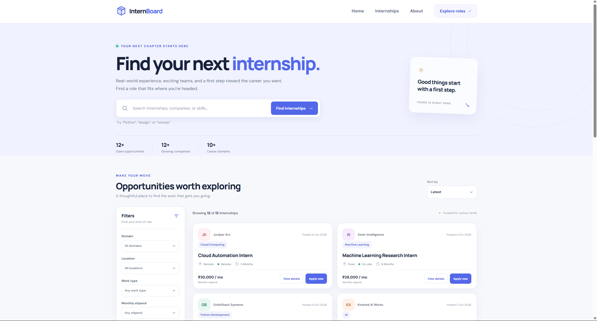
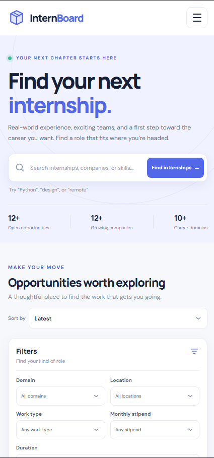

# Responsive Internship Board

## About

InternBoard is a responsive, beginner-friendly internship discovery dashboard. It helps students explore fictional early-career roles across technology, design, and data using searchable listings, practical filters, and an accessible details dialog. All companies and openings are fictional; the Apply links are demo email drafts addressed to reserved `.example` domains and do not submit real applications.

## Features

- Search internship titles, companies, skills, domains, locations, and work types as you type.
- Combine domain, location, work type, stipend, and duration filters.
- Sort by latest, oldest, stipend, or company name.
- See a live result count and a helpful empty state.
- Browse internship cards and full role details loaded dynamically from JSON.
- Open and close the details dialog with a keyboard or pointer.
- Use the responsive mobile navigation, with no third-party JavaScript dependencies.
- See a clear, retryable error state if the internship data cannot be loaded.

## Technologies

- HTML5
- CSS3
- Vanilla JavaScript
- JSON

## Accessibility

The page uses semantic landmarks and headings, a skip link, explicitly associated form labels, real buttons, and visible focus styles. Search and filters work with the keyboard, and updates to the result count are announced with a polite live region. The native modal dialog traps focus while open, closes with Escape, and includes a labeled close button. Color is not the only way information is communicated, and the layout respects reduced-motion preferences.

## Screenshots

Add screenshots of the desktop, tablet, and mobile layouts here after running the project. For example:

```md


```

## Live Demo

https://your-live-demo-url.com

## GitHub

Add your repository URL here: `https://github.com/your-username/your-repository`

## How to Run

The page uses `fetch()` to load `data/internships.json`, so run it through a local web server rather than opening `index.html` directly with a `file://` URL.

1. Open a terminal in the `internship-board` folder.
2. Start any static local server. For example, if Python is installed:

   ```bash
   python -m http.server 8000
   ```

   Or, if Node.js is installed, use a static server such as `npx serve .`.

3. Open `http://localhost:8000` (or the local URL shown by your server) in a browser.

No build step or package installation is required.

## Deploy to GitHub Pages

1. Create a GitHub repository and add the contents of this `internship-board` folder to its root.
2. Push the files to the repository’s default branch.
3. In the repository, open **Settings → Pages**.
4. Under **Build and deployment**, choose **Deploy from a branch**, select the default branch and the `/ (root)` folder, then save.
5. Wait for GitHub Pages to publish the site. Keep `index.html`, `style.css`, `script.js`, and the `data/` folder at the same relative paths; the JSON fetch path is relative and works for repository project pages.

## Project Structure

```text
internship-board/
├── index.html
├── style.css
├── script.js
├── data/
│   └── internships.json
└── README.md
```
