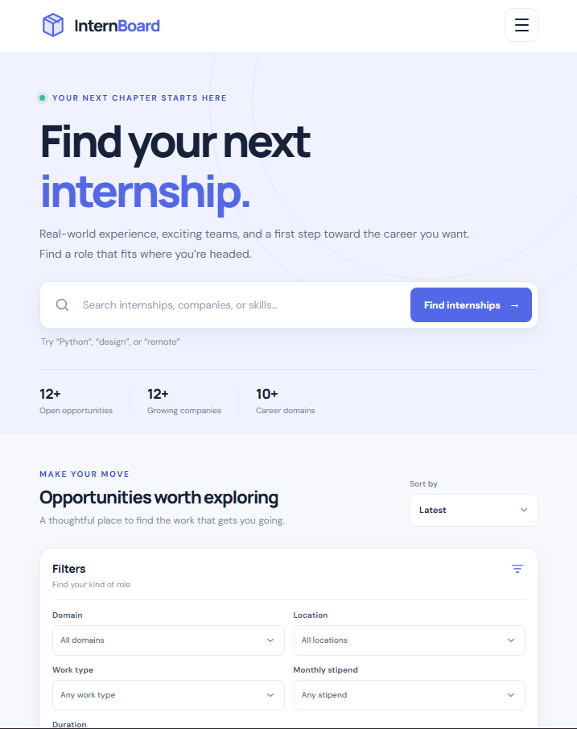

# Responsive Internship Board

## About

InternBoard is a responsive, beginner-friendly internship discovery dashboard designed to help students explore fictional early-career opportunities across technology, design, and data.

The platform provides searchable internship listings, practical filters, sorting options, accessible interactions, and responsive layouts for desktop, tablet, and mobile devices.

> **Note:** All companies and internship openings are fictional. The Apply buttons use demo email drafts with reserved `.example` domains and do not submit real applications.

---

## Features

- Search internship titles, companies, skills, domains, locations, and work types in real time.
- Combine multiple filters including:
  - Domain
  - Location
  - Work Type
  - Stipend
  - Duration
- Sort internships by:
  - Latest
  - Oldest
  - Highest Stipend
  - Lowest Stipend
  - Company Name
- Live internship result count.
- Helpful empty state when no results are found.
- Internship cards rendered dynamically from JSON data.
- Detailed internship information displayed in an accessible modal dialog.
- Keyboard-friendly navigation.
- Responsive mobile navigation.
- Clear and retryable error state when internship data cannot be loaded.
- No third-party JavaScript frameworks or dependencies.
- Fully responsive across desktop, tablet, and mobile devices.

---

## Technologies

- HTML5
- CSS3
- Vanilla JavaScript
- JSON

---

## Accessibility

The website follows accessibility-focused development practices, including:

- Semantic HTML landmarks and headings.
- Skip navigation link.
- Explicitly associated form labels.
- Real HTML buttons.
- Visible keyboard focus styles.
- Keyboard-accessible search and filters.
- Polite live region for dynamically updated result counts.
- Accessible modal dialog.
- Escape key support for closing the modal.
- Focus management inside the modal.
- Proper image alternative text.
- Color is not the only method used to communicate information.
- Reduced-motion preference support.

---

## Screenshots

### Desktop


### Tablet



### Mobile


---

## Live Demo

[Open Live Website](https://snadiok4923a.github.io/Internship/)

---

## GitHub Repository

[View Source Code on GitHub](https://github.com/snadiok4923A/Internship)

---

## How to Run Locally

The website uses `fetch()` to load internship data from:

`data/internships.json`

Therefore, the project should be run through a local web server instead of opening `index.html` directly using a `file://` URL.

### Using Python

Open a terminal inside the project folder and run:

```bash
python -m http.server 8000